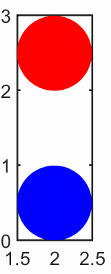

{}
数据下载：[fall.py](fall.py)
{}

- **视频教程**：[4自由落体和Paraview颜色配置](https://www.bilibili.com/video/av91259173)

其中，`fall.py` 中内容如下：


程序必须以START、RESTORE和LOAD开始一个计算，上面的实例是以start开始的，生成了两个颗粒，固定蓝色颗粒，红色颗粒作自由落体运动。

- 动态图如下：

                                

{}
软件中所涉及的参数的单位均采用国际制标准单位（即千克kg，米m，秒s，牛N，帕Pa等）。
{}

- YADE手册中有一个类似的[实例](https://yade-dem.org/doc/tutorial-examples.html#bouncing-sphere)

